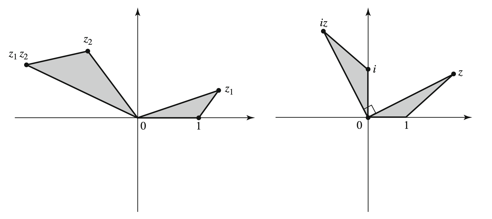

# Complex Numbers

## The Field of Complex Numbers

**Definition**: The complex field $\mathbb C$ is the set of ordered pairs $(a, b)$ with addition/multiplication given by:

$$
\begin{align*}
    (a, b) + (c, d) &= (a + c, b + d) \\
    (a, b) \cdot (c, d) &= (ac - bd, ad + bc)
\end{align*}
$$

* addition and multiplication is commmutative, associative, and the distributive property is satisfied
* $(0, 0)$ is the additive identity, and $(-a, -b)$ is the additive inverse
* multiplicative identity is $(1, 0)$
* multiplicative inverse of $(a, b)$ is $(\frac{a}{a^2 + b^2}, \frac{-b}{a^2 + b^2})$
  * obtained by solving $(a, b)(x, y) = (x, y)(a, b) = (1, 0)$ for $x$ and $y$

The set of complex numbers $\lbrace (a, 0) \mid a \in \mathbb R \rbrace \subseteq \mathbb C$ is isomorphic to the reals since
* $(a_1, 0) + (a_2, 0) = (a_1 + a_2, 0) \iff a_1 + a_2$
* $(a_1, 0) \cdot (a_2, 0) = (a_1 a_2, 0) \iff a_1a_2$

Note that $(0, 1)$ is the square root of $(-1, 0) \iff -1$ since

$$
    (0, 1) \cdot (0, 1) = (-1, 0 \cdot 1 + 1 \cdot 0) = (-1, 0) \iff -1
$$

and we write $i$ for $(0, 1)$.

Since $a(b, c) = (a, 0)(b, c) = (ab, ac)$, we can identify $(a, b)$ with $a + bi$ since

$$
    (a, b) = (a, 0) + (0, b) \iff a + bi
$$

Every complex number has two square roots.

$$
    a + bi = (x + iy)^2 = x^2 - y^2 + i(2xy)
$$

and solving the system: $a = x^2 - y^2$ and $b = 2xy$ gives

$$
x = \pm \sqrt{\frac{a + \sqrt{a^2 + b^2}}{2}}, y = (\operatorname{sgn} b) \sqrt{\frac{-a + \sqrt{a^2 + b^2}}{2}}
$$

**Example**: $\sqrt {2i} = \pm(1 + i)$

*Proof*: $\left(\pm(1 + i)\right)^2 = 1 + 2i - 1 = 2i$. $\blacksquare$

**Example**: $\sqrt{-5 - 12i} = \pm (2 - 3i)$

*Proof*: $\left( \pm (2 - 3i) \right)^2 = 4 - 12i  -9 = -5 - 12i$. $\blacksquare$

**Example**: Quadratic formula for a complex polynomial $az^2 + bz + c = 0, a, b, c \in \mathbb Z$, $a \neq 0$ is

$$
    z = \frac{-b \pm \sqrt{b^2 - 4ac}}{2a} 
$$

## The Complex Plane

The complex plane is formed by associating each complex number $a + bi$ with the point $(a, b)$ in the Cartesian plane.

The x-axis is called the **real axis** and the y-axis the **imaginary axis**.

$z_1 + z_2$ is the vector sum of $z_1$ and $z_2$.

$z_1z_2$ is the vector that forms a triangle $\triangle O,z_2,z_1z_2$ similar to $\triangle 0,1,z_1$.

**Definition**: Let $z = x + yi \in \mathbb C$. Then
* $\Re(z)$ or $\operatorname{Re}(z)$, the **real part** of $z$, is $x$.
* $\Im(z)$ or $\operatorname{Im}(z)$, the **imaginary part** of $z$, is $y$.
* $\bar z$, the **conjugate** of $z$, is $x - iy$.
* $\vert z \vert$, the **absolute value** or **modulus** of $z$ is $\sqrt{x^2 + y^2}$
* $\operatorname{Arg} z$, the **argument** of $z$, defined for $z \neq 0$, is the angle that the vector $z$ (originating from the origin) makes with the positive $x$-axis, that is

$$
    \cos \theta = \frac{\Re(z)}{\vert z \vert}, \sin \theta = \frac{\Im(z)}{\vert z \vert}
$$

* the **polar form** of $z$ is $z = r(\cos \theta + i\sin \theta)$ where $r = \vert z \vert$ and $\theta = \operatorname{Arg} z$
  * $\cos \theta + i \sin\theta$ is abbreviated as $\operatorname{cis}\theta$

Note that in the complex plane, $\bar z$ is $z$ reflected along the real-axis.

**Proposition**: Let $z_1 = r_1\operatorname{cis}\theta_1$ and $z_2 = r_2\operatorname{cis}\theta_2$. Then
* $z_1z_2 = r_1r_2\operatorname{cis}(\theta_1 + \theta_2)$
  * it follows that $z^n = r^n\operatorname{cis}(n \theta)$
* $z_1 / z_2 = (r_1 / r_2)\operatorname{cis}(\theta_1 - \theta_2)$

**Example**: Find the cube roots of $1$ in $\mathbb C$.

We have $r^3 \operatorname{cis} 3\theta = 1 \operatorname{cis} 0$, so

$$
    z_1 = \operatorname{cis} 0, z_2 = \operatorname{cis} \frac{2\pi}{3}, z_3 = \operatorname{cis} \frac{4\pi}{3}
$$

Note that $z_1, z_2, z_3$ form an equilateral triangle inscribed in the unit circle.

**Example**: The $n$-roots of $1$ form an $n$-gon inscribed in the unit circle.

## Topological Aspects of the Complex Plane

**Definition**: The sequence $(z_n)$ **converges** to $z$ if the sequence of real numbers $\vert z_n - z \vert$ converges to $0$.

**Proposition**: $z_n \to z$ if and only if $\Re(z_n) \to \Re(z)$ and $\Im(z_n) \to \Im(z)$.

*Proof*: $(\rightarrow)$ Suppose $z_n \to z$. Since $\vert \Re(z) \vert \leq \vert z \vert$ for all $z \in \mathbb C$, $\vert \Re(z_n - z) \vert \leq \vert z_n - z \vert$, and since $\vert z_n - z \vert \to 0$, $\vert \Re(z_n) - \Re(z) \vert \to 0$ as well. And likewise for the imaginary part.

$(\leftarrow)$ Suppose the real and imaginary parts converge. Then

$$
\begin{align*}
\vert z_n - z \vert &= \vert (x_n - x) + i(y_n - y) \vert \\
&= \sqrt{(x_n - x)^2 + (y_n - y)^2} \\
&\to_{n \to \infty} 0
\end{align*}
$$

$\blacksquare$

**Definition**: $(z_n)$ is a **Cauchy sequence** if for each $\epsilon \gt 0$ there exists an integer $N$ such that $n, m \gt N$ implies $\vert z_n - z_m \vert \lt \epsilon$.

**Proposition**: $(z_n)$ converges if and only if $(z_n)$ is a Cauchy sequence.

*Proof*: ($\rightarrow$) Suppose $(z_n)$ converges. Then the real and imaginary parts converge, so $(\Re(z_n))$ and $(\Im(z_n))$ are Cauchy sequences. We have

$$
\begin{align*}
\vert z_n - z_m \vert
&= \vert \Re(z_n - z_m) + \Im(z_n - z_m) \vert \\
&\leq \vert \Re(z_n) - \Re(z_m) \vert + \vert \Im(z_n) - \Im(z_m) \vert
\end{align*}
$$
so $(z_n)$ is also Cauchy.

($\leftarrow$) Suppose $(z_n)$ is Cauchy. Then since $\vert \Re(z_n) - \Re(z_m) \vert \leq \vert z_n - z_m \vert$, the sequence of the real parts is Cauchy, so the sequence of the real parts converge. Likewise for the sequence of imaginary parts. Therefore $(z_n)$ converges. $\blacksquare$

**Definition**: An infinite series $\sum_{k = 1}^\infty z_k$ **converges** if the sequence $(s_n)$ of partial sums, defined by $s_n = z_1 + z_2 + \dots + z_n$ converges. The limit of the sequence is called the **sum of the series**.

*Proposition*:
1. The sum and difference of two convergent series are convergent.
2. $z_n \to 0$ as $n \to \infty$ is a necessary condition for convergence.
3. Convergence of $\sum_{k = 1}^\infty \vert z_k \vert$ is a sufficient condition for $\sum_{k = 1}^\infty z_k$ to converge. Then $\sum_{k = 1}^\infty z_k$ is **absolutely convergent**.

**Example**: $\sum_{k = 1}^\infty \frac{1}{k + i}$ diverges, since $\frac{1}{k + i} = \frac{k - i}{k^2 + 1}$, and the real part of this sequence diverges by the limit comparison test.

**Definitions**:
* $D(z_0; r)$ is the open disc of radius $r \gt 0$ centered at $z_0$, also called the **neighborhood**  of $z_0$
* $C(z_0; r)$ is the circle of radius $r \gt 0$ centered at $z_0$
* A set $S$ is open if for any point in $S$ there is an open neighborhood around it contained in $S$.
* The complement of $S$ is $\mathbb C \setminus S$.
* A set is **closed** if its complement is open.
  * Equivalently, it is closed if every convergent sequence in $S$ converges to a point in $S$.
* The **boundary of $S$**, $\partial S$, is the set of points such that every neighborhood has a nonempty intersection with $S$ and $S \setminus \mathbb C$.
* $\overline S$, the **closure** of $S$, is given by $\overline S = S \cup \partial S$.
* $S$ is **bounded** if it is contained in $D(0; M)$ for some $M \gt 0$.
* Sets that are closed and bounded are **compact**.
* $S$ is **disconnected** if there exist two disjoint open sets $A$ and $B$ whose union contains $S$ while neither $A$ nor $B$ alone contains $S$.
* $S$ is **connected** if it is not disconnected.
* A **line segment** is $[z_1, z_2]$.
* A **polygonal line** is a finite union of line segments.
* If any two points of $S$ can be connected by a polygonal line contained in $S$, $S$ is **polygonally connected**.

**Proposition**: A polygonally connected set is connected.

*Proof*: Suppose $S$ is polygonally connected. Suppose for the sake of contradiction that it is disconnected. Choose disjoint open sets $A$ and $B$ that cover $S$. Let $a \in A$ and $b \in B$. Then, there is a polygonal line $z_0, z_1, \dots, z_n$ connecting $a$ and $b$. Since Since $z_0 \in A$ and $z_1$ is connected to $z_0$, then $z_1 \in A$. Similarily, $z_2, \dots, z_n \in A$. But, $z_n = b$, which is in $B$; a contradiction. $\blacksquare$

**Definition**: An open connected set is called a **region**.

**Proposition**: A region $S$ is polygonally connected.

*Proof*: Let $z_0 \in S$. Let $A$ be the set of points in $S$ which can be polygonally connected to $z_0$ in $S$ and $B$ the points that can't. Then $A$ is open since any point $z$ can be connected to any other point in $D(z; \delta)$. Similarily, $B$ is open since if any point in a disc about $z$ could be connected to $z_0$, then $z$ could be connected to $z_0$. Since $S$ is connected, $A$ and $B$ are disjoint, and $S = A \cup B$, $B$ must be empty. So, every point in $S$ can be connected to $z_0$, so every pair of points can be connected to each other by a polygonal line in $S$.

**Definition**: Let $f: \mathbb C \to \mathbb C$ be defined in a neighborhood of $z_0$. $f$ is **continuous** at $z_0$ if $z_n \to z_0$ implies $f(z_n) \to f(z_0)$.
* Equivalently, $f$ is continuous at $z_0$ if for all $\epsilon \gt 0$, there is some $\delta \gt 0$ such that $\vert z - z_0 \vert \lt \delta$ implies $\vert f(z) - f(z_0) \vert \lt \epsilon$.
* $f$ is **continuous in a domain $D$** if for each sequence $(z_n) \subseteq D$ and $z \in D$, if $z_n \to z$ then $f(z_n) \to f(z)$.

**Remark**: $f$ is continuous if and only if its real and imaginary parts are continuous.

**Remark**: The sum, product, and quotient (with non-zero denominator) of continuous functions are continuous.

**Definition**: $f \in C^n$ if the real and imaginary parts of $f$ both have continuous partial derivatives of the $n$-th order.