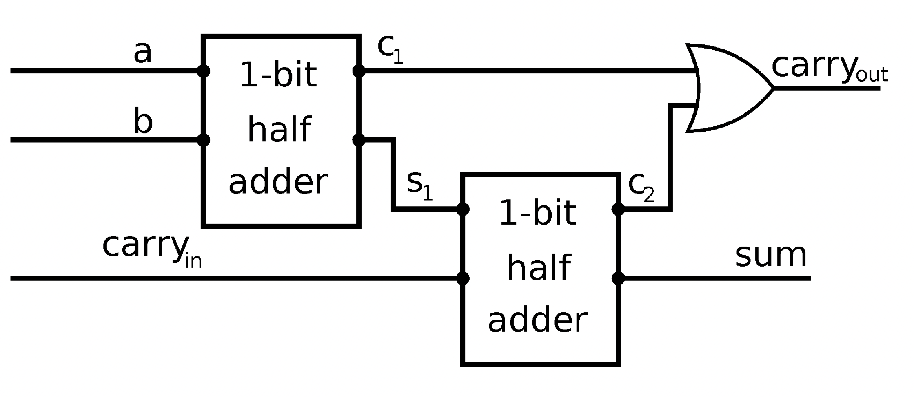
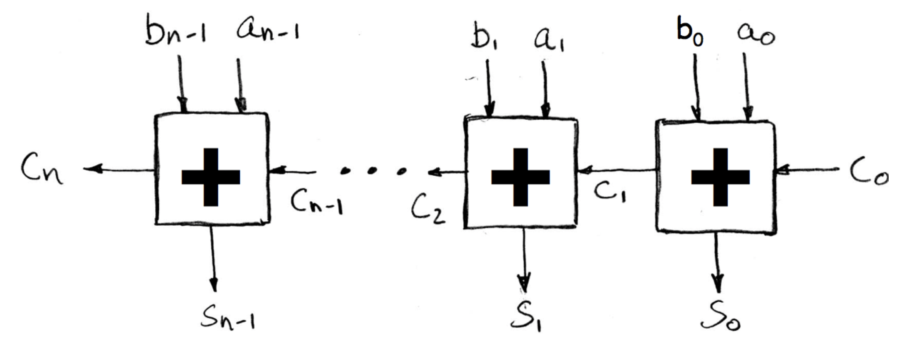
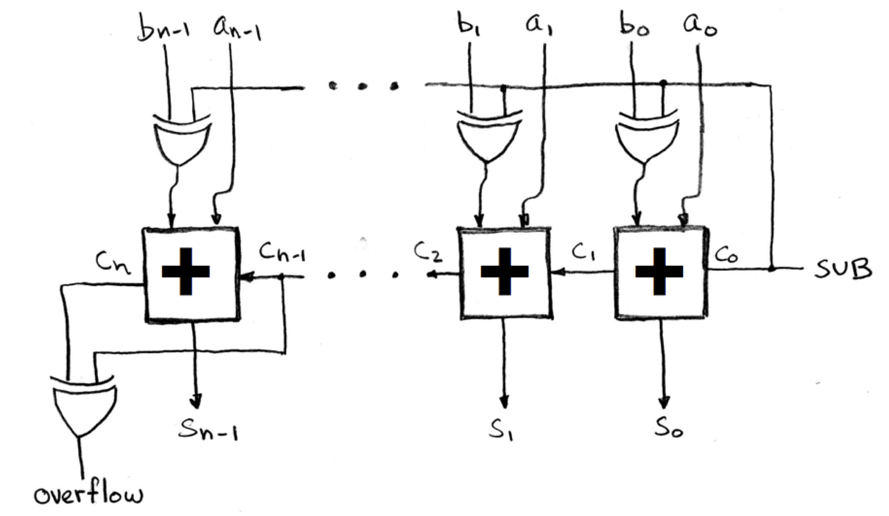
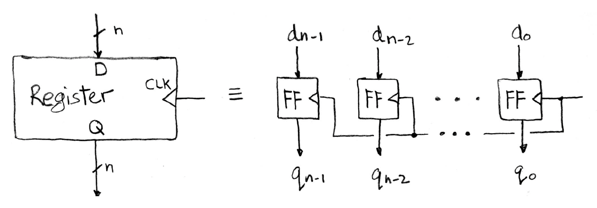
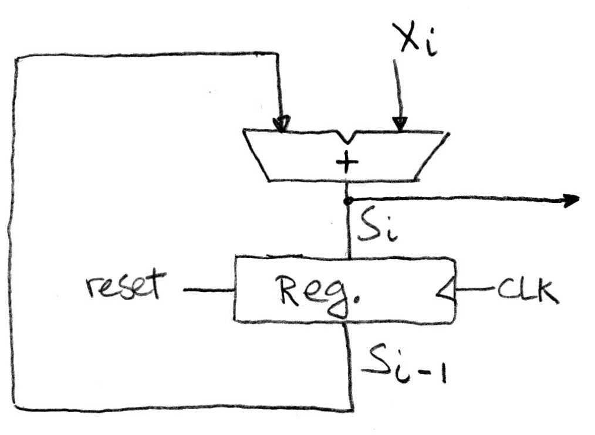
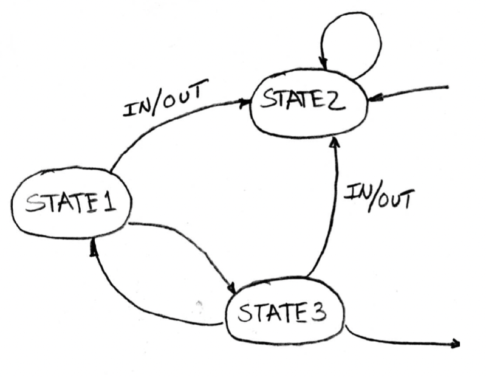

# Computer Architecture

## Introduction

**von Neumann architecture**: shared memory banks + buses for instructions and data

**Harvard architecture**: seperate memory banks + buses for instructions and data

**CPU-Memory Gap**: increasing difference in speeds between DRAM, disk, and CPU speeds
* contributor to the **Memory Wall**: the point where a program's speed is entirely determined by memory speed

### Eight Great Ideas in Computer Architecture
1. Use abstraction to simplify design
2. Design for Moore's Law
3. Make the common case fast
4. Performance via parallelism
5. Performance via pipelining
6. Make the common case fast
7. Hierarchy of memories
8. Dependability via redundancy

## CPU

Runtime of a program determined by:
1. CPU clock speed
2. Type of instructions performed (e.g. multiplication/division take longer than addition/subtraction)
3. Memory speed (access time)

Performance largely measured through **throughput**, **latency**, and **clock speed**.

### CPI

CPI = clock cycles per instruction = average CPI = effective CPI

CPU time = CPI $\times$ instruction count $\times$ clock cycle

### Power

**power wall**: limitation in processor development preventing processors from consuming any more power
* decreasing transistor size lowers voltage but increases power density, causing extra heat
* reducing voltage usage is hard, removing extra heat is even harder
* reason for possbile failing of Moore's Law
* alternative: use multi-core processors or multiprocessors

## Memory Hierarchy

The memory hierarchy was introduced to tackle the memory wall and reduce the effects of the Processor-Memory gap. Also:
* fast storage technologies (SRAM) are expensive and take more room
* gap between DRAM (main memory) and CPU continues to widen
* principle of locality

### Principle of Locality

**temporal locality**: recently accessed items are likely to be accessed again in the near future

**spatial locality**: recently accessed items are likely to have nearby items accessed in the near future

### Cache Hierarchy

CPU looks in L1 cache, then L2, then L3, then main memory.

NOTE: despite the numbering, L3 is a "lower level cache" than L2, which is a lower level cache than L1.

**placement (mapping) policy**: where should a new block to be loaded in the cache go?
**replacement policy**: which block should be evicted from the cache (to load a new block)

**cold miss (at level $k$)**: occurs when a block is missing for the first time at level $k$; these are unavoidable

**conflict miss (at level $k$)**: mapping policies dictate where blocks can go in the cache: conflict misses occur when multiple data items from level $k + 1$ map to the same position in level $k$

**capacity miss (at level $k$)**: a conflict miss that occurs because the cache is full: these would occur even if the cache was fully-associative with LRU replacement

### Cache and Memory Performance

With caching, the CPU time formula changes:

CPU Time = instruction count $\times$ clock cycle $\times$ (CPI + average memory stall cycles)

Average memory stall cycles = access rate $\times$ miss rate $\times$ miss penalty

(CPI + average memory stall cycles) is called **CPI stall**
CPI inside **CPI stall** is also called **CPI ideal**

**banked cache**: cache divided into two sections: one for instructions and one for data: L1 is usually banked cache

**unified cache**: cache where instructions and data are stored together

**average memory access time (AMAT)**: average time to access memory considering both hits and misses

AMAT = hit time + miss penalty $\times$ miss rate

For multiple cache levels:

AMAT = L1 hit time + L1 miss rate $\times$ L1 miss penalty

L1 miss penalty = L2 hit time + L2 miss rate $\times$ L2 miss penalty

...

L3 miss penalty = Main memory hit time

## Cache Implementation

Hierarchy management:
* registers <-> cache memory: compiler decides which values goes into registers
* cache memory <-> main memory: cache controller (hardware) handles memory movement
* main memory <-> disk: OS (virtualization), TLB (hardware), programmer (files)

The cache is split into $S$ sets, with $B$ blocks in each. Each block has a tag field used to differentiate between different items currently loaded in the cache.

A memory address is decomposed as the `tag | set index | block offset`

Addresses are assumed to be byte addresses (not word addresses).

### Cache Organization Schemes

**direct-mapped**: one block per set; each memory address mapped to exactly one line in the cache; no tag needed

**fully associative**: one set: memory address can be mapped to any block; tag is whole address except block offset

**N-way set associative**: N sets

#### Set Associativity Cost

* N comparators for LRU, MUX delay, can't assume a hit and recover later (since block isn't available until after hit/miss decision)

### Handling Cache Hits and Misses

Read hit: do nothing

Write hit policies (data only)
1. write-through: maintain consistency between cache and main memory by writing to cache AND main memory; amortize performance by using a write buffer
2. write-back: allow inconsistency, marking blocks as dirty when written to. Only write back to main memory on eviction (requires >2 cycles, 1 to check dirty and 1 to write-back; alternatively, use write-buffer for just 1 cycle)

Read miss policies:
1. stall execution, fetch block from lower cache level, install into higher cache level, and resume

Write miss policies (data only): stall execution and
1. write-allocate: fetch block from lower cache, write updated value, and install in cache
2. no write-allocate: write to lower cache without installing into cache (or use a write buffer)

### Cache Design

* primary cache should focus on **minimizing hit time**
* secondary caches should focus on **minimizing miss penalty** of primary cache

Reducing hit time:
* smaller cache size, smaller block size
* direct-mapping
* use write buffer for write-through/write-back policies

Reducing miss rate:
* larger cache, larger block size
* increase associativity
* use **victim-cache**: cache of most recently evicted blocks

Reducing miss penalty:
* smaller block size
* use write-buffer
* check write-buffer/victim cache on read miss
* use multi-level cache
* faster main memory
* improve memory bandwidth for memroy transfer between cache levels

## Boolean Algebra

**conjunctive normal form (CNF)**: conjuction of disjunctions

**disjunctive normal form (DNF)**: disjunction of conjunctions

A set of operators is **functionally complete** if it is enough to describe any operation in boolean algebra
* NAND, NOR, $\lbrace \land, \neg \rbrace$, $\lbrace \lor, \neg \rbrace$ are functionally complete

## Stateless Circuits

combinational circuits = stateless circuits = functional blocks
* circuits whose output depend solely on its inputs

**block (schematic) diagram**: specifies inputs, outputs, number of bits for each, and formula/truth table

**1-bit half-adder**: XOR gate for sum, AND for carry

**1-bit full-adder**: 

**n-bit full-adder**:

* unsigned addition: overflow if last carry bit $c_n$ is 1
* signed addition: overflow if $c_n \oplus c_{n - 1}$

**n-bit subtractor**:

**multiplexer**: select between multiple inputs with control signal $c$:

$$
    MUX(a, b, c) = a \bar c + b c
$$

* output $a$ when $c = 0$ and $b$ when $c = 1$

**demultiplxer** chooses among its outputs

## State Circuits

* combinational circuits cause propagation delay: need to synchronize with a clock
  * faster components use a clock multiplier

**delay flip-flop**: sets state to input after some delay

|$D$|$Q$|$Q_{next}$|
|---|---|---|
|0  |   |0  |
|1  |   |1  |

**toggle flip-flop**: $T$ toggles state if $T \equiv 1$, otherwise does nothing

**SR flip-flop**: 
* $S \equiv 1$ sets the state
* $R \equiv 1$ clears the state
* $S \equiv 0, R \equiv 0$ doesn't change anything
* $S \equiv 1, R \equiv 1$ not allowed

**JK flip-flop**: SR flip-flop except both set to 1 toggles the state

**parallel-in parallel-out**:

**serial-in parallel-out**:

**serial-in serial-out**: one input bit, one output bit

**parallel-in serial-out**: one bit output at a time, bits shifted over on each output; requires additional control signal for write/shift operation

**clk-to-q delay**: propagation delay of a flip-flop

**setup time**: stable signal value to the input of a flip-flop required before the rising edge of the clock

**hold time**: stable signal value to the input of a flip-flop required after the rising edge of the clock
* usually less than clk-to-q delay

**clocked accumulator**:

* note that we only need to clock the register, not the combinational circuit
  
minimum clock period = combinational circuit delay + clk-to-q delay + setup time

## Finite State Machines

**Mealy machine**: FSM whose output depends on current state and current input

1. Generate truth table
2. Simplify boolean expressions for next state and output bits
3. Draw logic diagram

## Introduction to MIPS

MIPS ISA is a RISC architecture with pipelining and without interlocking.

MIPS is big-endian.

### MIPS Registers

32 32-bit registers
* $0 always holds the value 0
* $at reserved for compiler
* $v0-v1 return values 
* $a0-a3 arguments
* $t0-t9 temporaries
* $s0-s7 saved registers (must be saved/restored by the callee)
* $gp global pointer for static data
* $fp frame pointer
* $sp stack pointer
* $ra return address

### MIPS Instruction Formats

**R-type (register) instructions** 

|opcode|source 1|source 2|destination|shift amount|function type|
|---|---|---|---|---|---|
|6 bits|5 bits|5 bits|5 bits|5 bits| 6 bits|

* for instructions that use `shamt` (shift amount), source 1 is always 0
  * e.g. `sll $s0, $t0, 4`
    * source 1 = 0
    * source 2 = `$t0`
    * destination = `$s0`
    * shamt = 4 
* for arithmetic instructions, function type determines the function the ALU will perform (opcode is usually 0 here)

**I-type (immediate) instructions**

|opcode|source 1|source 2 (or destination)|immediate|
|---|---|---|---|
|6 bits|5 bits|5 bits|16 bits|

* note for `sw $t1, 32($t0)`, `$t1` is the destination and `$t0` is the source
* **relative PC addressing**: branch immediates are multiplied by 4 before being added to the PC

**J-type (jump) instructions**

|opcode|target (jump address)|
|---|---|
|6 bits|26 bits|

* only `j` and `jal` instructions
* **pseudo-direct addressing**: `target` is multiplied by 4 and OR-ed with the upper 4-bits of the PC to form the new PC

### MIPS Single-Cycle Datapath

minimum clock cycle needs to be long enough to run all 5 stages in one clock cycle

#### Instruction Fetch
1. Update value of PC on rising clock edge
2. Fetch instruction from memory and pass to next stage
3. Compute PC + 4

#### Instruction Decode
1. Decompose instruction into bit segments
2. Read opcode, determine R/I/J instruction type
3. Access operand values from registers
4. Extend to 32-bit immediate if needed

#### Execute
* do the actual work of the instruction in the ALU: add, subtract, shift, etc.
* for data-transfer instructions, compute the absolute address from the immediate and base address

#### Memory Access
* access memory with the address calculated in the execute stage

#### Write Back
* write back the calculated/accessed value to the destination register

Multiplexers needed in datapath for:
* choosing between PC + 4 and PC branch/jump
* write-back from ALU or from memory
* choosing between register or immediate for ALU input

