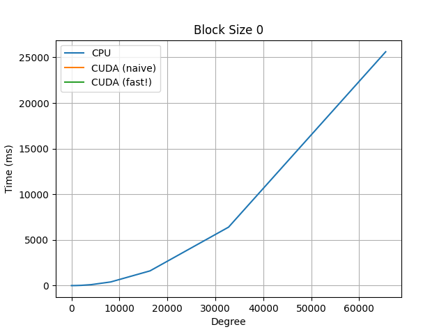
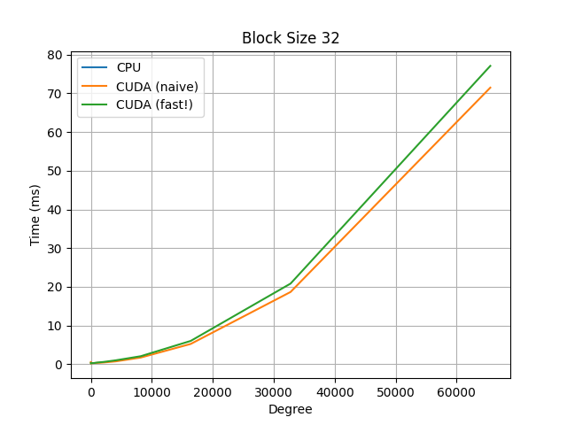
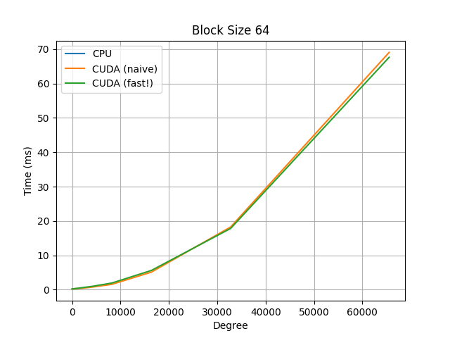
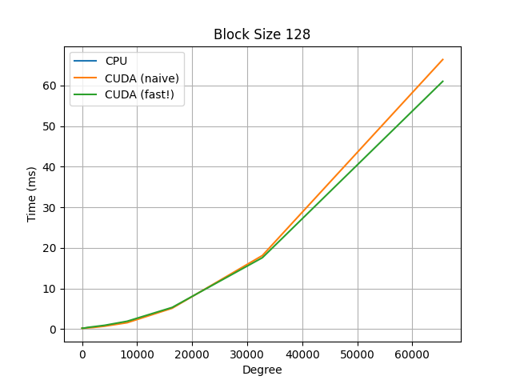
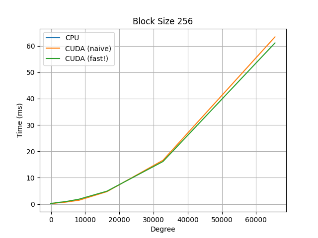
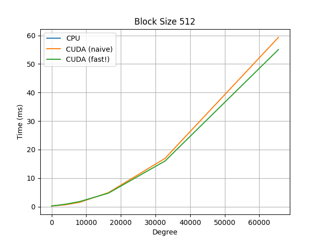

# Parallel Polynomial Univariate Multiplication

## Build

Run `make` in the root directory to build `./poly_mul`. 

Ensure that the `CUDA` path points to your local CUDA installation directory.

Run `make clean` to remove any build files and the executable itself.

## Code

The `output.txt` file contains the output of the program when run as `./poly_mul`. The `output.csv` is parsed from `output.txt` using `parse_output.py`. The various graphs in the folder were created using `plot_output.py` and `output.csv`.

The main driver code is in `main.cu`, while the matrix multiplication kernels are found in `poly_mul.hpp`.

## Results

Running `fastest_block_size.py` takes the `output.csv` and computes which of the block sizes result in optimal performance for the fast CUDA kernel: 

```
The block size with the fastest average time for CUDA (fast!) is 512with an average time of 5.101166375 ms.
Additional information for degree 2^11 and 2^15 (CUDA fast!):
Degree 2^11:
    Execution Type  Degree  Block Size  Time (ms)
      cuda (fast!)    2048         512   0.537824
Degree 2^15:
    Execution Type  Degree  Block Size  Time (ms)
      cuda (fast!)   32768         512    15.9878
```

which shows that a block size of 512 is also the fastest for degrees 2^11 and 2^15, specifically.

For additional comparisons, observe the below graphs, which compare a naive serial CPU implementation, the same naive implementation but on a CUDA kernel, and a faster CUDA kernel implementation, which uses a polyhedral method to re-parameterize the indices to allow for more efficient parallelization.

Note the y-axis for the CPU graph (blue curve): we observe almost a 500x speed-up using the CUDA kernels.








